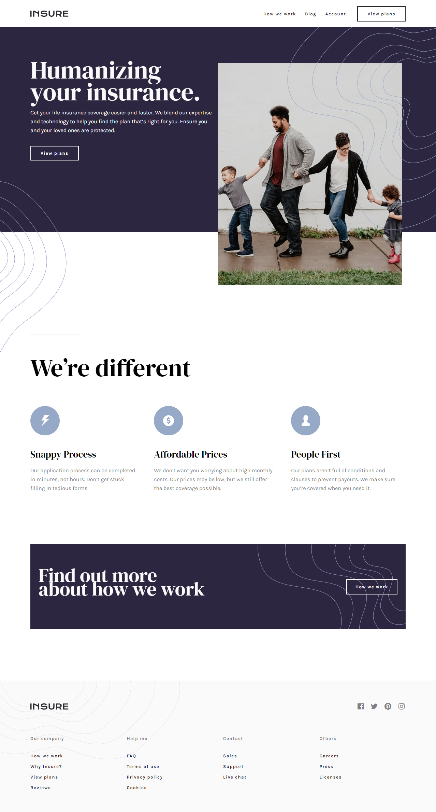

# Frontend Mentor - Insure landing page solution

This is a solution to the [Insure landing page challenge on Frontend Mentor](https://www.frontendmentor.io/challenges/insure-landing-page-uTU68JV8). Frontend Mentor challenges help you improve your coding skills by building realistic projects. 

## Table of contents

- [Overview](#overview)
  - [The challenge](#the-challenge)
  - [Screenshot](#screenshot)
  - [Links](#links)
- [My process](#my-process)
  - [Built with](#built-with)
- [Author](#author)

## Overview

### The challenge

Users should be able to:

- View the optimal layout for the site depending on their device's screen size
- See hover states for all interactive elements on the page

### Screenshot

### Links

- Solution URL: [https://github.com/tvgc/insure-landing-page-master](https://github.com/tvgc/insure-landing-page-master)
- Live Site URL: [https://tvgc.github.io/insure-landing-page-master/](https://tvgc.github.io/insure-landing-page-master/)

## My process

### Built with

- Semantic HTML5 markup
- CSS custom properties
- Flexbox
- CSS Grid
- Mobile-first workflow
- CSS Conventions
  - [Namespaces](https://zellwk.com/blog/css-architecture-2/)
  - [BEM](https://zellwk.com/blog/css-architecture-1/)
  - [SMACSS](http://smacss.com/)

## Author

- Frontend Mentor - [@tvgc](https://www.frontendmentor.io/profile/tvgc)